# Diffusion Transformer for Flow Prediction

This project implements a diffusion-based transformer model to simulate and predict fluid dynamics, inspired by the [DiffFluid paper (2024)](https://arxiv.org/abs/2409.13665). Our own findings and extensions can be found in our paper, "[Predicting Flow Dynamics using Diffusion Models](https://arxiv.org/abs/2507.08106)".

This work reproduces the original paper's results on Navier-Stokes simulations and extends the evaluation to the Lattice Boltzmann Method (LBM), demonstrating the versatility of Denoising Diffusion Probabilistic Models (DDPMs) as general-purpose solvers for flow dynamics.

---

### **Visualizing Fluid Dynamics: Ground Truth vs. Model Predictions**

Our model successfully predicts complex fluid behaviors across different simulation types. Below, you can see a comparison of the ground truth fluid dynamics (top row) against our model's predictions (bottom row) after correcting our training pipeline.

*   **Navier-Stokes Simulation (Vorticity Field):**
    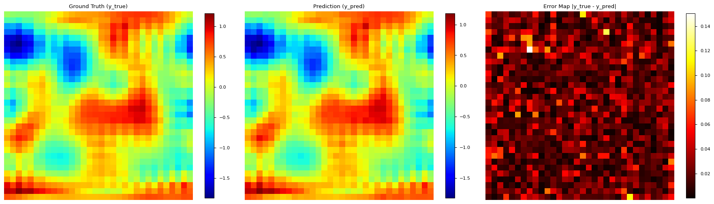
    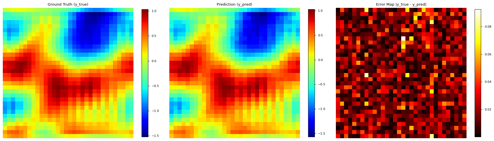
    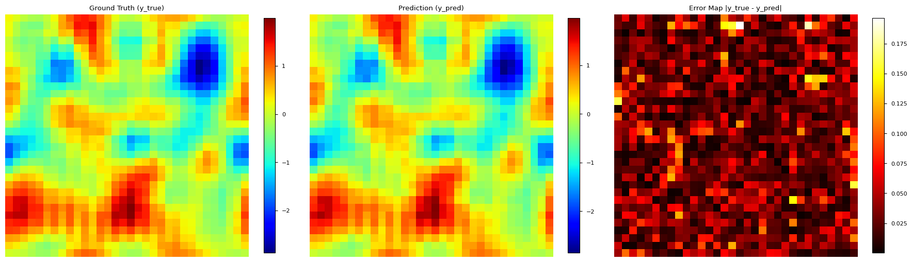
    *Figure: Ground Truth vs. Prediction from the Navier-Stokes model after correction.*

*   **Lattice-Boltzmann Simulation (Density Field):**
    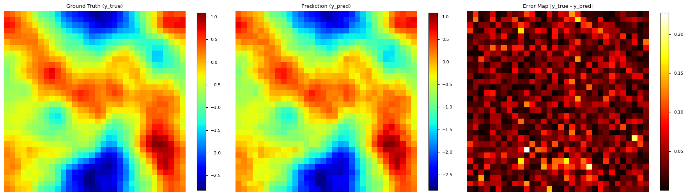
    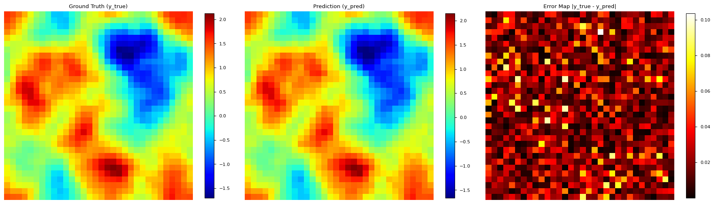
    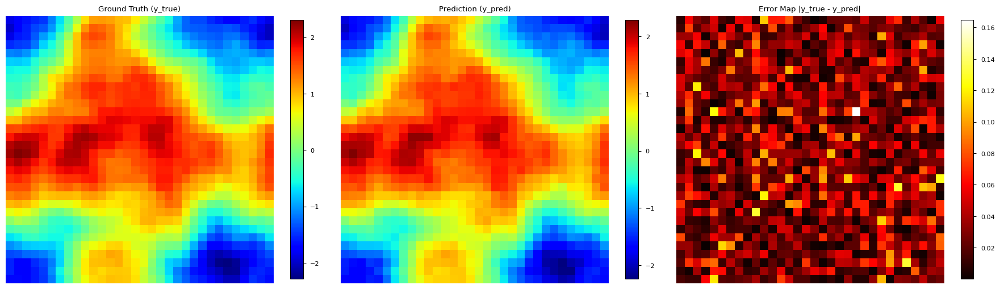
    *Figure: Ground Truth vs. Prediction from the Lattice-Boltzmann model after correction.*

---

## Project Goals

*   Reproduce the results from the DiffFluid paper using a U-Net + Transformer-based diffusion model.
*   Test the model’s generalizability by applying it to two different simulation frameworks: Navier-Stokes and the Lattice Boltzmann Method (LBM).
*   **Identified and corrected critical pitfalls in the training process, including a fundamental error in the loss formulation, which dramatically improved prediction quality.**
*   Evaluate model performance using both quantitative metrics (MSE, L2 error) and qualitative visualizations of the predicted flow.

## Methodology

*   **Simulation Types:**
    *   **Navier-Stokes:** Solved using a spectral solver with Crank-Nicholson time integration. The dataset consists of vorticity fields on a 32×32 grid.
    *   **Lattice Boltzmann (D2Q9):** Simulates 2D shear instability. The dataset contains density snapshots over 50 timesteps.
*   **Model Architecture:**
    *   A U-Net-style encoder-decoder with Transformer layers to capture global context.
    *   The model is trained within a DDPM framework to predict and remove noise from a corrupted input sequence, thereby generating a clean prediction for the next timestep.
*   **Training:**
    *   The model is trained with a combined Mean Squared Error (MSE) and L1 loss function.
    *   Gradient clipping and dropout are used to stabilize training.
    *   The AdamW optimizer and a `ReduceLROnPlateau` learning rate scheduler are used.

## Results

| Simulation Type     | Relative L2 Error |
|---------------------|------------------|
| Navier-Stokes       | 0.07967          |
| Lattice-Boltzmann   | 0.0598           |

The model successfully learned to generate physically coherent predictions for both simulation types. Correcting an error in the original loss formulation dramatically improved both MSE and the visual quality of the output.

### Training Progress & Correction Impact

A key achievement was identifying and rectifying a critical error in our initial loss function implementation, where the model was incorrectly trying to predict the ground truth state instead of the noise added to the input. This correction led to stable convergence and significantly improved results.

*   **Navier-Stokes Simulation Training Loss:**
    *   **Before Correction:** (Notice the artificially low and misleading loss values)
        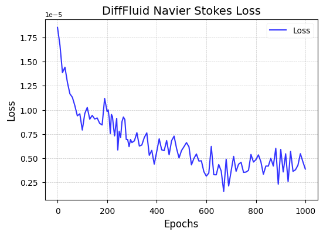

        *Figure 1: Training MSE + L1 loss curve for Navier-Stokes DiffFluid model before the correction.*
    *   **After Correction:** (Demonstrates robust convergence)
        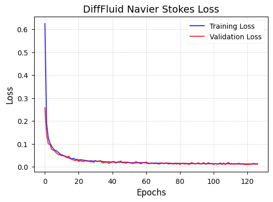

        *Figure 2: Training MSE + L1 loss curve for Navier-Stokes DiffFluid model after the correction.*

*   **Lattice-Boltzmann Simulation Training Loss:**
    *   **Before Correction:** (Similar misleading loss behavior)
        
        *Figure 3: Training MSE + L1 loss curve for Lattice-Boltzmann DiffFluid model before the correction.*

    *   **After Correction:** (Clearer, more accurate convergence)
        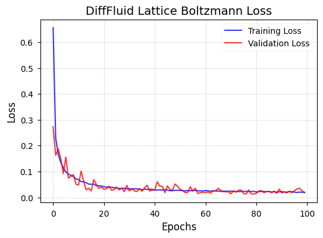

        *Figure 4: Training MSE + L1 loss curve for Lattice-Boltzmann DiffFluid model after the correction.*

### Visualizing the Impact of Correction on Predictions

The visual quality of predictions drastically improved after the correction.

*   **Navier-Stokes Predictions:**
    *   **Before Correction (Inaccurate):**
        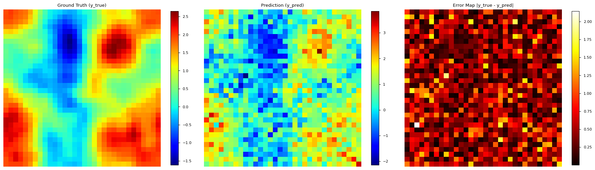

        *Figure 5: Ground Truth vs. Prediction from the Navier-Stokes model after training for 1000 epochs on the wrong method.*
    *   **After Correction (Accurate):**
        *Already showcased at the top for immediate impact. See Figure 6.*

*   **Lattice-Boltzmann Predictions:**
    *   **Before Correction (Inaccurate):**
        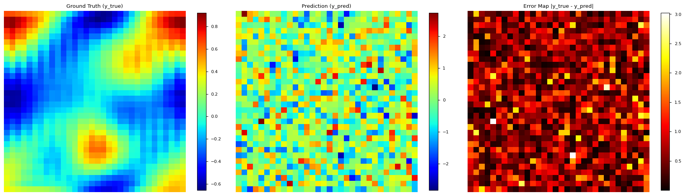
        
        *Figure 7: Ground Truth vs. Prediction from the Lattice-Boltzmann model after training for 1000 epochs on the wrong method.*
    *   **After Correction (Accurate):**
        *Already showcased at the top for immediate impact. See Figure 8.*

---

## Technologies

*   **Python**
*   **PyTorch:** For building and training the diffusion model.
*   **Jupyter Notebook:** For interactive development and visualization.
*   **NumPy:** For numerical operations.
*   **Matplotlib:** For creating visualizations of the flow dynamics.